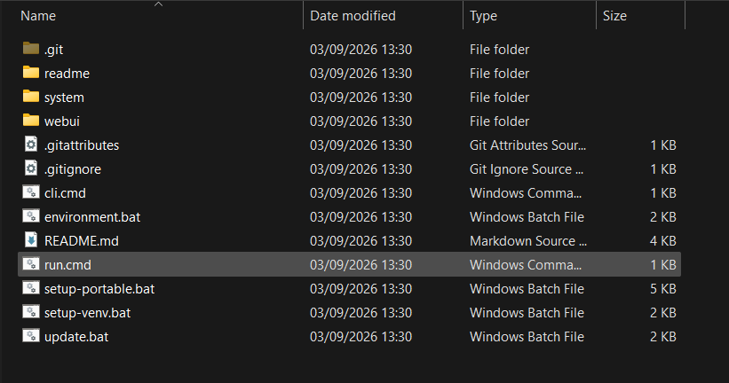
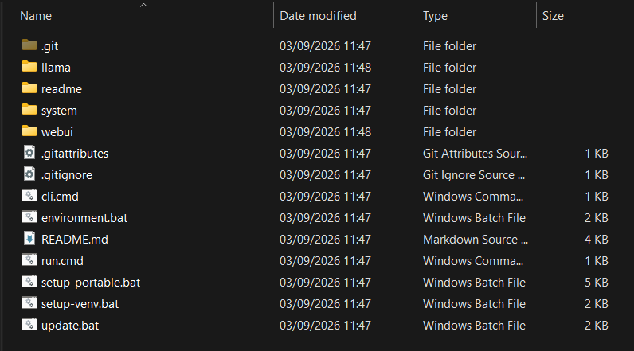
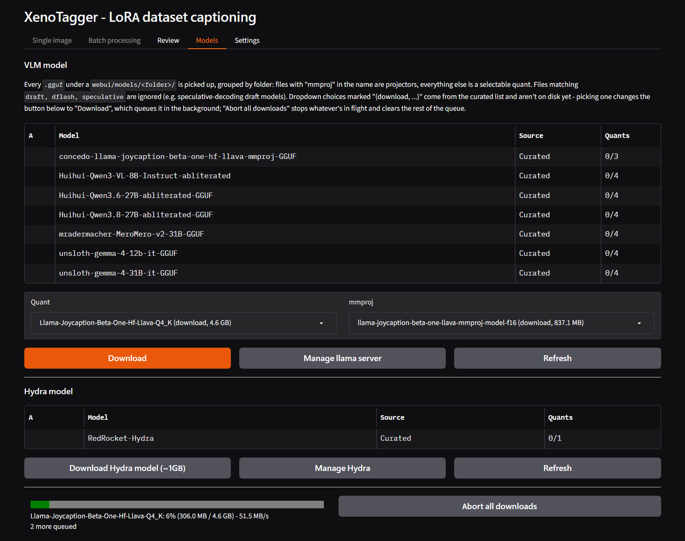
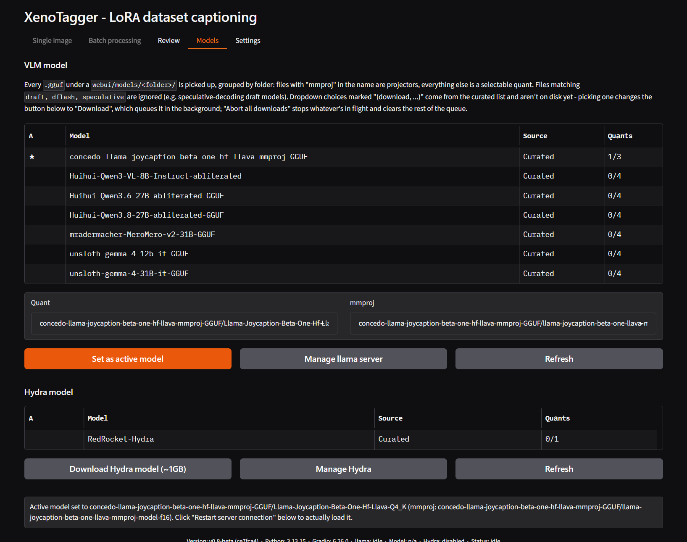
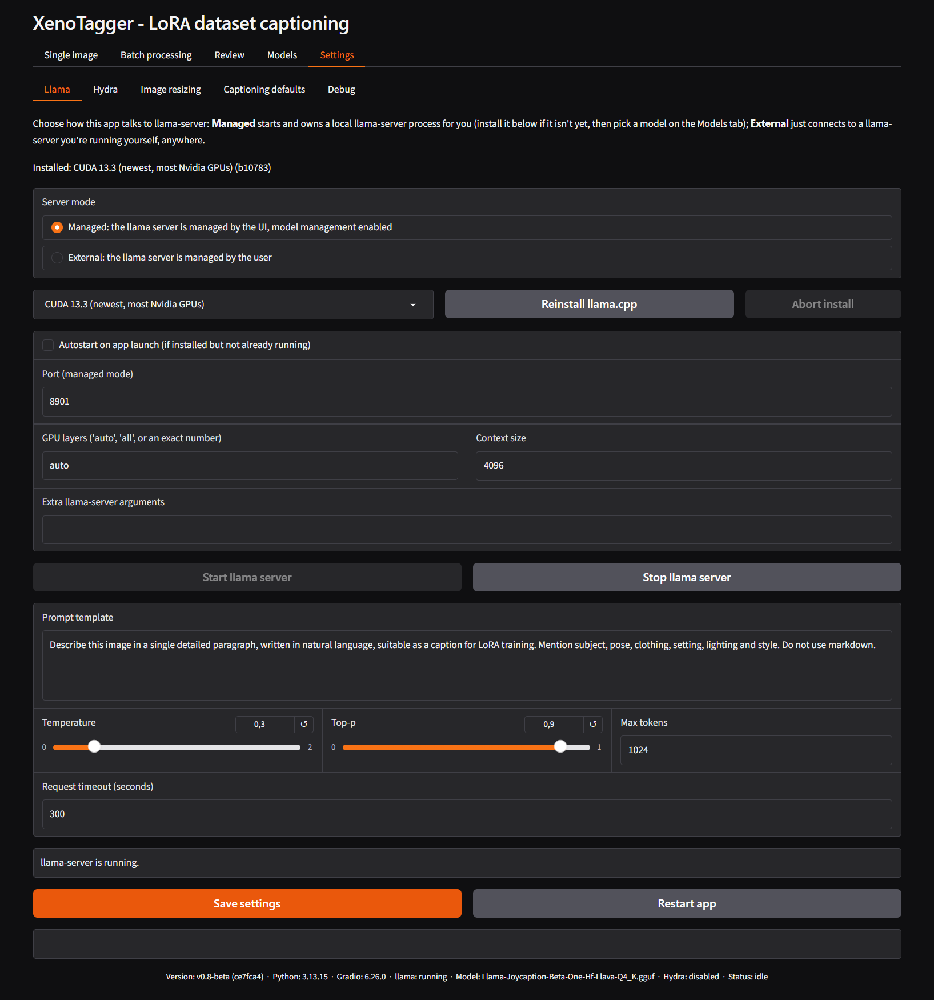
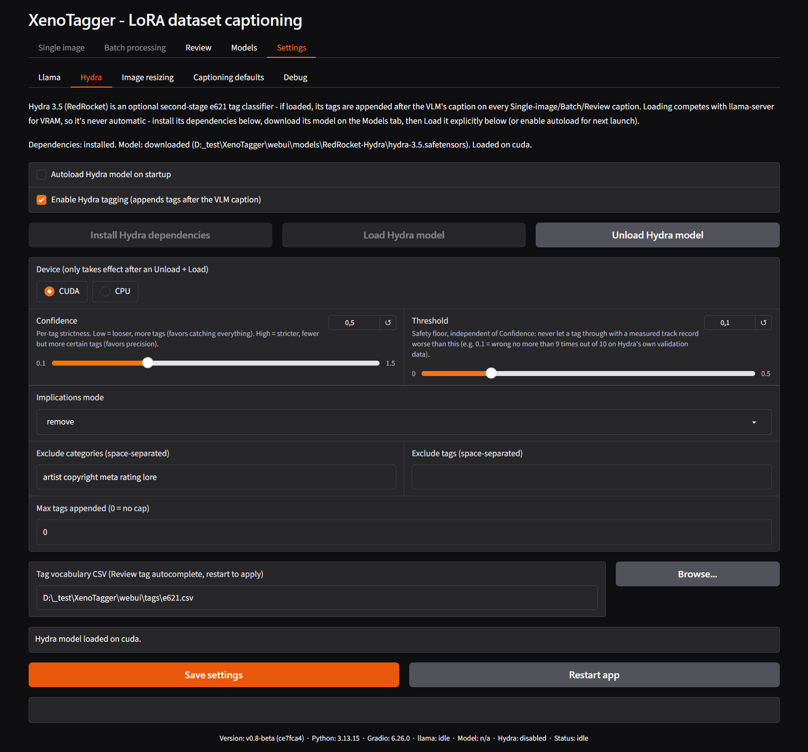

# First run walkthrough

This page lists every step required to go from a freshly installed copy
of XenoTagger to a completed batch-captioning and review pass, using the
managed llama.cpp server. It assumes the application has already been
installed and can be launched (see the repository's main `README.md` for
setup scripts).

The vision model (VLM) step is written generically: XenoTagger works
with any vision-capable GGUF model, whether picked from the built-in
curated list or supplied manually. Pick whichever model fits the
available GPU and intended captioning style.

## 1. Launch the application

Run `run.cmd`. On first launch:

- No llama.cpp backend is installed yet.
- No vision model is selected.
- The **Single image**, **Batch processing**, and **Models** tabs are
  disabled (greyed out) until the app's first connectivity check
  completes and confirms no usable server is reachable - this is
  expected. **Review** and **Settings** remain available immediately.
- The status bar at the bottom of the window reads `llama: not
  installed` (or similar) and `Model: n/a`.

## 2. Install a llama.cpp backend

1. Open **Settings → [Llama](tab-settings-llama.md)**.
2. Confirm **Server mode** is set to **Managed** (the default).
3. In the backend dropdown, pick the build matching the GPU:
   - **CUDA 13.3** - newest, most current Nvidia GPUs (default selection).
   - **CUDA 12.4** - older Nvidia GPUs or drivers.
   - **ROCm 7.14** - AMD GPUs.
   - **CPU only** - no GPU, or GPU troubleshooting.
4. Click **Install llama.cpp**. Progress is shown in the status row
   below the dropdown.
5. Wait for the row above the dropdown to read `Installed: <backend>
   (<build>)`. **Start llama server** becomes clickable once installation
   finishes.

Do not start the server yet - no model is selected.

| Before installing | After installing |
|---|---|
|  |  |

Installing a backend adds a `llama\` folder to the repository root,
holding the `llama-server.exe` build and its runtime files.

## 3. Select a vision model

1. Open the **[Models](tab-models.md)** tab.
2. Under **VLM model**, either:
   - Click a row marked with a source of **Curated**, choose a **Quant**
     (and, if applicable, **mmproj**) from the dropdowns, then click
     **Download** to fetch it. Wait for the download status row to
     clear; or
   - Place a GGUF model file and its matching `mmproj` GGUF file in
     their own folder under `webui/models/<folder>/`, then click
     **Refresh** to detect them.
3. Click the model's row in the table, confirm the **Quant** and
   **mmproj** dropdowns show the intended files, then click **Set as
   active model**. The button relabels to **Set as active model** only
   once both files are available locally - while anything is still
   curated-only, the same button reads **Download** instead.
4. The table's **A** column marks the active model with a star once set.

## 4. Start the server

1. Click **Manage llama server** (Models tab) or return to **Settings →
   Llama**.
2. Click **Start llama server**.
3. Confirm in the status bar at the bottom of the window:
   - `llama: running`
   - `Model:` shows the selected model's filename (not `n/a`).
4. The **Single image**, **Batch processing**, and **Models** tabs
   become clickable.

If the status bar instead reads `error`, check **Settings → Llama** for
a message in the infotext row below the Start/Stop buttons, or the
[Debuglog](tab-debuglog.md) tab (enable it first in **Settings →
Debug**) for the server's own output.

## 5. Verify with a single image

1. Open the **[Single image](tab-single-image.md)** tab.
2. Upload one test image.
3. Optionally enter a **Trigger word**.
4. Click **Caption**. The button is replaced by **Interrupt** while the
   request is in flight; the infotext bar below shows the current stage.
5. Confirm a caption appears in the **Caption** box, and the infotext
   bar reports completion (elapsed time, token count).
6. Click **Save caption** to write a `.txt` file next to the source
   image, confirming the round trip works end to end.

If the caption is empty, garbled, or the request times out, revisit the
**[Llama](tab-settings-llama.md)** settings - in particular **Request
timeout**, **Max tokens**, and the **Prompt template** - before
continuing.

## 6. (Optional) Enable Hydra tagging

Hydra appends e621-style tags after the VLM caption. It runs in-process
and competes with the vision model for GPU memory, so every step here is
manual by design.

1. Open **Settings → [Hydra](tab-settings-hydra.md)**.
2. Click **Install Hydra dependencies**. This is a one-time, several-
   hundred-MB Python package install.
3. Open the **[Models](tab-models.md)** tab and click **Download Hydra
   model (~1GB)** under the **Hydra model** section.
4. Return to **Settings → Hydra** and click **Load Hydra model**.
   - If the managed llama server is running and owned by this app, it is
     stopped, Hydra is loaded, then the server is restarted so its
     automatic GPU-layer sizing can adjust around Hydra's memory usage.
5. Check **Enable Hydra tagging**.
6. Click **Save settings**.
7. Re-run the Single image test from step 5 - the Caption box should now
   show the VLM caption followed by a line of e621 tags.

See [Settings – Hydra](tab-settings-hydra.md) for what each slider and
filter does, and the [Hydra confidence & threshold FAQ](faq-hydra-setting.md)
for a deeper explanation of the Confidence/Threshold sliders.

## 7. Run a batch

1. Open the **[Batch processing](tab-batch-processing.md)** tab.
2. Enter (or **Browse...** to) a folder of images.
3. Optionally set a **Trigger word**. Leave **Overwrite existing
   captions** unchecked on a first run, so any pre-existing `.txt` files
   are left alone.
4. Click **Run batch**. The preview panel, **Last file processed**, and
   **Last caption created** fields update as each image completes.
5. Confirm a `.txt` file now exists next to each image in the folder.

See the [batch sidecar & overwrite FAQ](faq-caption.md) for exactly what
happens when `.txt`, `.txt.nlp`, or `.txt.tags` files already exist.

## 8. Review the results

1. From the Batch processing tab, click **Send to Review** (enabled once
   a valid directory is entered) - this switches to the Review tab and
   scans the same folder automatically. Alternatively, open
   **[Review](tab-review.md)** directly and click **Scan**.
2. Step through images with **←** / **→** or by clicking a row in the
   file table.
3. Edit **Caption** and/or **Tags** as needed - edits save automatically
   when navigating to another image.
4. Use **Recaption** on any individual image to re-run just that one
   through the VLM (and Hydra, if enabled).

## Verification checklist

- [ ] Backend installed (`Settings → Llama` shows `Installed: ...`)
- [ ] A vision model is set active (Models tab shows a starred row)
- [ ] Status bar shows `llama: running` and a real model filename
- [ ] A single test image captions successfully and saves a `.txt` file
- [ ] (Optional) Hydra dependencies installed, model downloaded, loaded, and enabled
- [ ] A batch run produces `.txt` files for a whole folder
- [ ] Review opens the same folder and shows the generated captions

---

[← Manual home](README.md) · [Single image tab →](tab-single-image.md)
