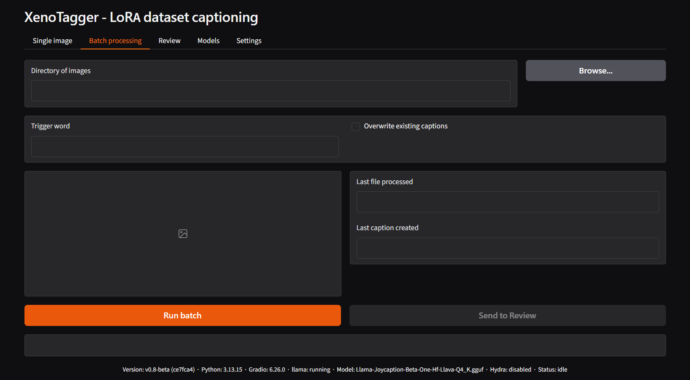
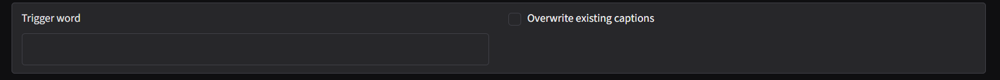
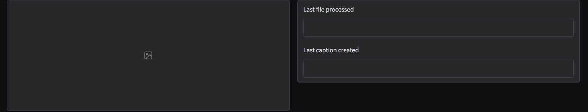

# Batch processing tab

Captions every image in a folder in one run, writing a `.txt` file next
to each one. Shares the same captioning logic (and the same
[Llama](tab-settings-llama.md)/[Hydra](tab-settings-hydra.md) settings)
as [Single image](tab-single-image.md).

This tab is disabled until a llama.cpp server is reachable - see the
[first run walkthrough](firstrun.md).

## Directory selector

- **Directory of images** - folder to process. Type a path directly, or
  click **Browse...** to pick one.

## Trigger word and overwrite

- **Trigger word** - prepended to every generated caption in this run.
  Pre-filled from [Settings – Captioning
  defaults](tab-settings-captioning-defaults.md); empty by default.
- **Overwrite existing captions** - unchecked by default. When checked,
  every image is regenerated from scratch, including ones that already
  have a `.txt` file or sidecar. When unchecked, an image with an
  existing `.txt` is skipped, and any pre-existing `.txt.nlp` /
  `.txt.tags` sidecar is adopted instead of being regenerated - see the
  [batch sidecar & overwrite FAQ](faq-caption.md) for the full case
  table.

## Preview and progress

- **Preview** - the most recently processed image.
- **Last file processed** - its filename.
- **Last caption created** - the caption written for it.

These fields update live as the batch progresses.

## Actions

- **Run batch** - starts processing the directory. While running, this
  button is replaced by **Interrupt**, which stops the batch after the
  image currently in progress finishes.
- **Send to Review** - enabled once **Directory of images** points to a
  real folder. Switches to the [Review](tab-review.md) tab and scans the
  same folder automatically. Does not require a batch run to have
  finished first, or even started.

A status line below the buttons reports overall progress.

## Related

- [Batch captioning sidecar & overwrite FAQ](faq-caption.md) - full detail on how existing `.txt`/`.txt.nlp`/`.txt.tags` files are handled.
- [Review tab](tab-review.md) - inspect and correct the results of a batch run.
- [Settings – Llama](tab-settings-llama.md) / [Settings – Hydra](tab-settings-hydra.md) - the parameters used for every image in the run.

---

[← Single image tab](tab-single-image.md) · [Manual home](README.md) · [Review tab →](tab-review.md)
