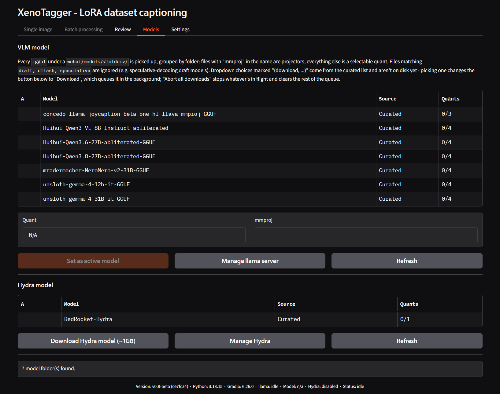
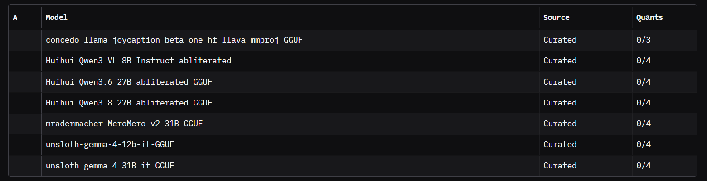
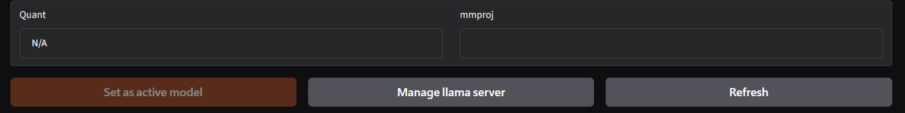
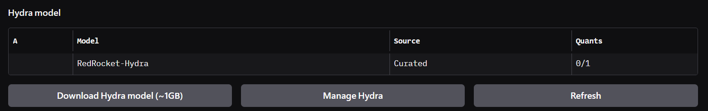
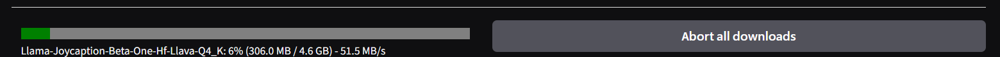

# Models tab

Selects, downloads, and refreshes the vision model used for captioning,
and shows the state of the Hydra tag classifier's own model file. This
tab is disabled until a llama.cpp server connection has been confirmed
reachable at least once - see the [first run walkthrough](firstrun.md).

## VLM model table

Every `.gguf` file found under a `webui/models/<folder>/` directory is
listed here, grouped by folder: files with `mmproj` in the name are
projectors, everything else is a selectable quant. Files matching
`draft`, `dflash`, or `speculative` are ignored (speculative-decoding
draft models, not real captioning models).

Columns:

- **A** - a star marks the currently active model.
- **Model** - the folder name (one row per model family).
- **Source** - `Curated` for an entry from the built-in downloadable
  list, blank for a purely local/manual model.
- **Quants** - how many of the family's known quant/mmproj files are
  already downloaded, out of how many are known (e.g. `2/3`).

A row marked **Curated** does not need anything downloaded yet to
appear - picking a not-yet-downloaded quant from the dropdowns below
queues it for download rather than selecting it.

Click a row to load its available quants/mmprojs into the dropdowns
below.

## Quant, mmproj, and actions

- **Quant** - the main model file for the selected row. Entries not yet
  downloaded are marked accordingly.
- **mmproj** - the vision projector file paired with the quant. Leaving
  this at its default (auto) picks the largest mmproj file present in
  the model's folder once it is set active.
- **Set as active model** / **Download** - one button that changes
  behavior based on the current selection: it reads **Set as active
  model** once both the chosen quant and mmproj already exist on disk,
  and **Download** if either one still needs to be fetched. Setting a
  model active only updates the configuration - it does not restart the
  server on its own; do that from **Settings → Llama**.
- **Manage llama server** - jumps to [Settings – Llama](tab-settings-llama.md).
- **Refresh** - rescans `webui/models/` for new or removed files.

## Hydra model

A single fixed row showing whether the Hydra classifier's own model file
(`hydra-3.5.safetensors`, roughly 1GB) is present.

- **Download Hydra model (~1GB)** - fetches it if missing.
- **Manage Hydra** - jumps to [Settings – Hydra](tab-settings-hydra.md).
- **Refresh** - rescans model state (shared handler with the VLM
  section's Refresh).

## Download status

Appears only while something is queued or downloading (a VLM model file
or the Hydra model share the same single download queue, so only one
transfer runs at a time). Shows progress text and an **Abort all
downloads** button, which cancels the current transfer and clears
anything still queued.

## Related

- [Settings – Llama](tab-settings-llama.md) - starting/stopping the server after changing the active model.
- [Settings – Hydra](tab-settings-hydra.md) - installing dependencies and loading the downloaded Hydra model.
- [First run walkthrough](firstrun.md) - step-by-step model setup for a new install.

---

[← Review tab](tab-review.md) · [Manual home](README.md) · [Settings – Llama →](tab-settings-llama.md)
