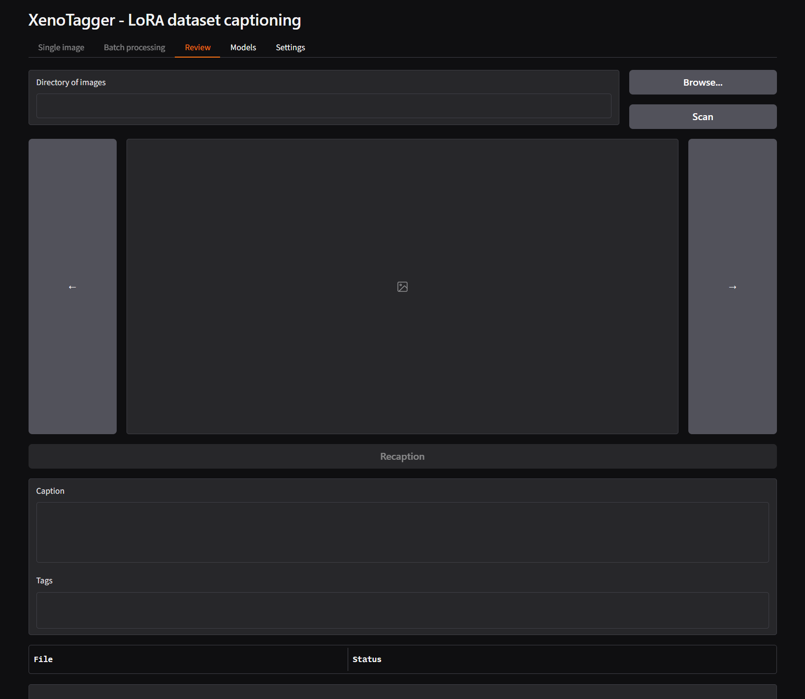
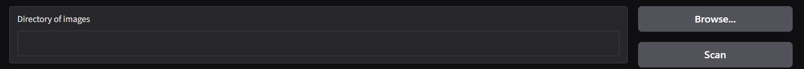
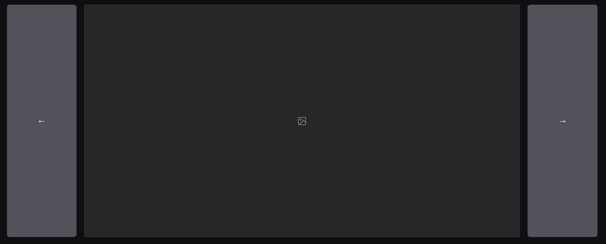
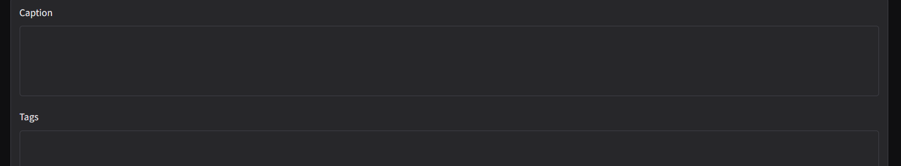
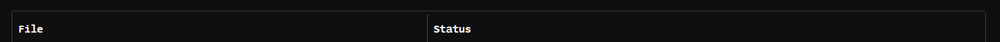

# Review tab

Browses an already-captioned folder image by image, for inspecting and
correcting captions and tags, and for re-running individual images.
Unlike [Batch processing](tab-batch-processing.md), Review makes no
model calls on its own - it only reads and writes caption files, except
when **Recaption** is used explicitly.

This is the only top-level tab available before a llama.cpp server has
been started, since browsing and editing existing captions does not
require one.

## Directory and scan

- **Directory of images** - folder to browse. Type a path, or click
  **Browse...**.
- **Scan** - (re-)scans the directory and loads its first image. Also
  runs automatically when this tab is opened via **Send to Review** from
  [Batch processing](tab-batch-processing.md).

## Image viewer

- **←** / **→** - move to the previous/next image in the scanned folder.
  Any unsaved edit to the current image's Caption or Tags is saved
  automatically before moving.
- The image itself, centered between the navigation arrows.

## Recaption

- **Recaption** - re-runs only the currently displayed image through the
  vision model (and Hydra, if enabled), using the same
  [Llama](tab-settings-llama.md)/[Hydra](tab-settings-hydra.md) settings
  as Batch processing. The result appears in the Caption/Tags fields but
  is **not saved automatically** - navigate away from the image, or edit
  and let autosave run, to keep it. While running, this button is
  replaced by **Interrupt**.

## Caption and Tags fields

- **Caption** - the descriptive part of the caption.
- **Tags** - the e621-style tag list, editable independently of the
  caption. Only disabled when the image's caption is a plain legacy
  `.txt` file with no `.txt.nlp`/`.txt.tags` sidecar ever created for it
  - the moment either sidecar exists, Tags becomes editable.

Edits to either field are saved automatically when navigating to another
image (arrows, table row click, or **Send to Review**), not on every
keystroke. See the [batch & review sidecar FAQ](faq-caption.md#the-review-tab-a-separate-per-item-file-existence-model)
for the exact load/save rules, including how a flat legacy caption first
becomes an editable Caption/Tags pair.

## File table

Lists every image found by the last scan, with its filename and status
(e.g. captioned, missing, tagged). Click a row to jump directly to that
image; the currently displayed image's row is highlighted.

## Related

- [Batch captioning sidecar & overwrite FAQ](faq-caption.md) - how Caption/Tags map to `.txt`/`.txt.nlp`/`.txt.tags` on disk.
- [Batch processing tab](tab-batch-processing.md) - the usual way a folder gets captions to review in the first place.
- [Settings – Llama](tab-settings-llama.md) / [Settings – Hydra](tab-settings-hydra.md) - parameters used by **Recaption**.

---

[← Batch processing tab](tab-batch-processing.md) · [Manual home](README.md) · [Models tab →](tab-models.md)
