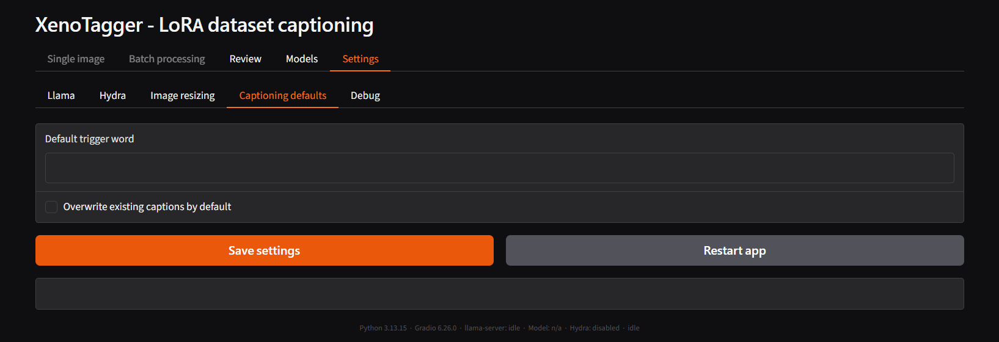

# Settings – Captioning defaults

Sets the default values pre-filled into the **Trigger word** and
**Overwrite existing captions** fields on
[Single image](tab-single-image.md) and
[Batch processing](tab-batch-processing.md). Each tab can still override
these per run without changing the default stored here.

- **Default trigger word** - default empty. Text prepended to every
  generated caption unless overridden on the tab itself.
- **Overwrite existing captions by default** - unchecked by default.
  When checked, both Single image and Batch processing start with
  **Overwrite existing captions** already checked, meaning a caption
  file that already exists is regenerated rather than skipped or
  adopted. See the [batch sidecar & overwrite FAQ](faq-caption.md) for
  what "existing" means when only a `.txt.nlp` or `.txt.tags` sidecar is
  present.

## Related

- [Batch captioning sidecar & overwrite FAQ](faq-caption.md)
- [Single image tab](tab-single-image.md)
- [Batch processing tab](tab-batch-processing.md)

---

[← Settings – Image resizing](tab-settings-image-resizing.md) · [Manual home](README.md) · [Settings – Debug →](tab-settings-debug.md)
