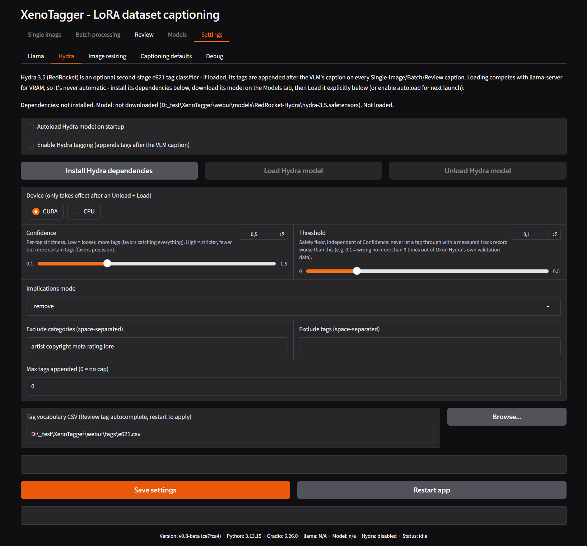
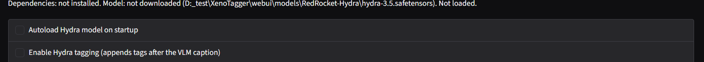
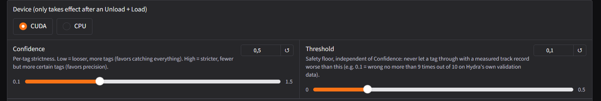
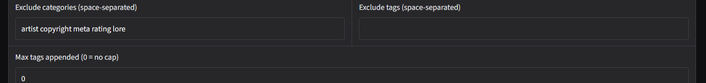
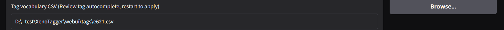

# Settings – Hydra

Configures Hydra 3.5 (RedRocket), an optional in-process e621 tag
classifier. When loaded and enabled, its output is appended after the
vision model's caption, on its own line, for every caption generated
across [Single image](tab-single-image.md),
[Batch processing](tab-batch-processing.md), and
[Review](tab-review.md)'s Recaption.

Hydra runs in the same process as the app, not as a separate server, and
competes with the vision model for GPU memory. Nothing here loads
automatically as a side effect of another setting - installing,
downloading, loading, and enabling are four separate, explicit steps.

## Status and toggles

A status line reports whether dependencies are installed, whether the
model file is downloaded, and whether it is currently loaded (and on
which device). On a fresh install this reads `Dependencies: not
installed. Model: not downloaded. Not loaded.`

- **Autoload Hydra model on startup** - unchecked by default. When
  checked, Hydra loads automatically the next time the app launches
  (before the managed llama server autostarts, if that is also enabled,
  so Hydra gets first pick of free GPU memory). Only interactive once
  dependencies are installed and the model is downloaded.
- **Enable Hydra tagging** - unchecked by default. Only controls whether
  an *already-loaded* model is used when captioning; it does not load
  one by itself. If checked with nothing loaded, tagging is silently
  skipped and the vision-model caption is used on its own.

## Install, load, unload

- **Install Hydra dependencies** - installs the Python packages Hydra
  needs (not part of the base install). A one-time step; disabled once
  already installed.
- **Load Hydra model** - loads the downloaded model into memory. If a
  managed llama server owned by this app is currently running and Hydra
  is set to load on CUDA, the server is stopped, Hydra is loaded, and
  the server is restarted afterward so its automatic GPU-layer sizing
  (`auto`) can adjust around Hydra's memory usage. Skipped if a
  captioning job is currently active. Requires the model file - see
  [Models](tab-models.md) → **Download Hydra model (~1GB)**.
- **Unload Hydra model** - frees the memory Hydra is using. Required
  before a device change takes effect.

## Device and tagging behavior

- **Device** - `CUDA` (default) or `CPU`. Only takes effect after an
  explicit Unload followed by Load; changing it while Hydra is loaded
  does nothing until then.
- **Confidence** - default `0.5`, range `0.1`–`1.5`. Per-tag strictness:
  lower values favor catching more tags (recall), higher values favor
  fewer, more certain tags (precision).
- **Threshold** - default `0.1`, range `0.0`–`0.5`. A hard safety floor,
  independent of Confidence: a tag whose measured accuracy on Hydra's
  own validation data falls below this value is never shown, no matter
  how Confidence is set.

  See the [Hydra confidence & threshold FAQ](faq-hydra-setting.md) for a
  full explanation of how these two interact.
- **Implications mode** - default `remove`. Controls how nested/related
  e621 tag families (e.g. `canine` → `dog` → `dobermann`) are collapsed
  or expanded in the output. See the
  [Hydra implications FAQ](faq-hydra-implications.md) for what each mode
  does and why `remove` is the default.

## Filters

- **Exclude categories (space-separated)** - default `artist copyright
  meta rating lore`. e621 tag categories dropped entirely from Hydra's
  output; the default set is not useful for LoRA captioning.
- **Exclude tags (space-separated)** - default empty. Individual tags to
  always drop, regardless of category.
- **Max tags appended (0 = no cap)** - default `0` (no limit). Caps how
  many tags are appended after filtering, keeping only the highest-
  probability ones if a limit is set.

## Tag vocabulary

- **Tag vocabulary CSV** - default `webui/tags/e621.csv`. Supplies the
  autocomplete list used by the **Tags** field on the
  [Review](tab-review.md) tab. Deliberately the full e621 tag space, not
  limited to tags Hydra itself can produce, so a tag neither model
  caught can still be typed in by hand with autocomplete. Takes effect
  on the next app restart, not immediately on Save.
- **Browse...** - pick a different CSV file.

## Related

- [Hydra confidence & threshold FAQ](faq-hydra-setting.md)
- [Hydra implications FAQ](faq-hydra-implications.md)
- [Models tab](tab-models.md) - downloading the Hydra model file.
- [Settings – Llama](tab-settings-llama.md) - the server Hydra's Load button may restart.

---

[← Settings – Llama](tab-settings-llama.md) · [Manual home](README.md) · [Settings – Image resizing →](tab-settings-image-resizing.md)
