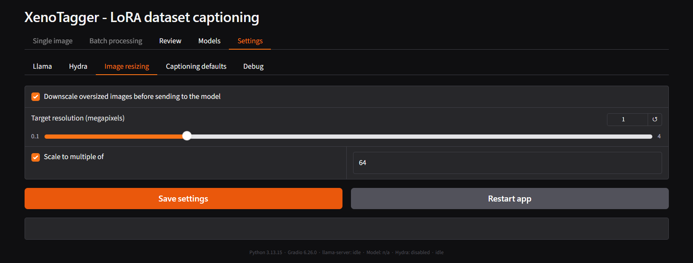
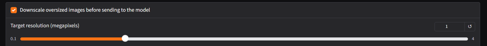
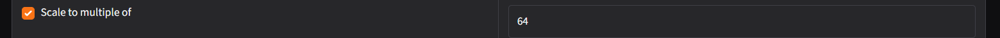

# Settings – Image resizing

Controls whether images are downscaled in memory before being sent to
the vision model. This never modifies the source file on disk - only
the in-memory copy sent to the model is affected. Applies to every
captioning path: [Single image](tab-single-image.md),
[Batch processing](tab-batch-processing.md), and
[Review](tab-review.md)'s Recaption.

Vision encoders tokenize proportionally to input resolution, so an
oversized source image can consume most of the model's context window
on the image alone, leaving little budget for the actual caption. These
settings exist to prevent that.

## Target resolution

- **Downscale oversized images before sending to the model** - checked
  by default.
- **Target resolution (megapixels)** - default `1.0`, range `0.1`–`4.0`.
  Images larger than this are downscaled before being sent; smaller
  images are left untouched (never upscaled).

## Scale to multiple of

- **Scale to multiple of** - checked by default. When a resize actually
  happens, snaps both output dimensions to a multiple of the value
  below: the shorter side by resizing, the longer side by center-
  cropping the excess rather than stretching it.
- Value field - default `64`. The multiple most SDXL-family and similar
  LoRA trainers expect for input dimensions.

Only applies when **Downscale oversized images** is checked and a resize
actually occurs - an image already at or under the target resolution is
never cropped or snapped.

## Related

- [Settings – Llama](tab-settings-llama.md) - Context size, which this setting helps protect from being consumed entirely by the image.

---

[← Settings – Hydra](tab-settings-hydra.md) · [Manual home](README.md) · [Settings – Captioning defaults →](tab-settings-captioning-defaults.md)
