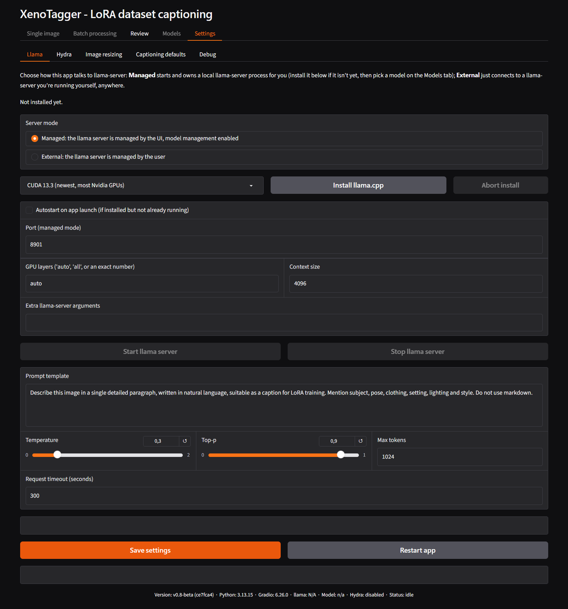
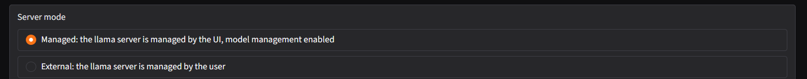
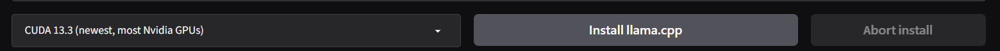
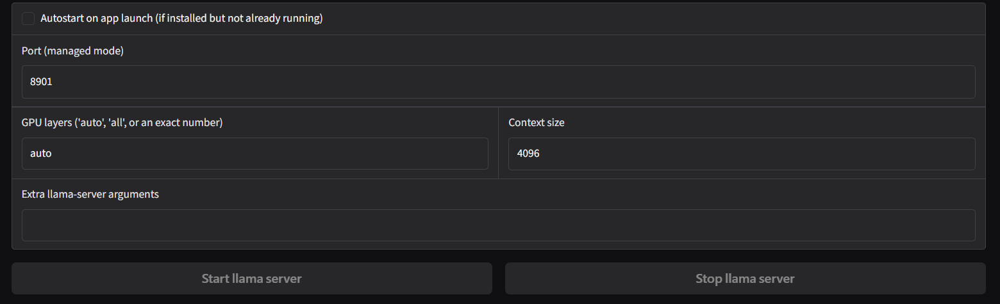
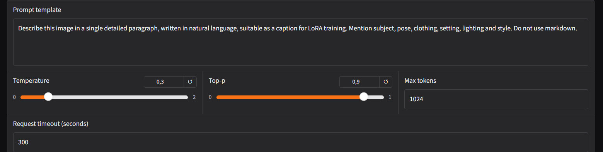

# Settings – Llama

Controls how XenoTagger talks to the llama.cpp vision server: whether
the app runs and owns that server itself, or connects to one running
elsewhere, plus every generation parameter used when captioning.

## Server mode

- **Managed** (default) - XenoTagger starts and owns a local
  `llama-server` process, bound to `127.0.0.1`. Requires installing a
  backend below and selecting a model on the [Models](tab-models.md)
  tab.
- **External** - XenoTagger only connects to a `llama-server` instance
  running independently, anywhere reachable by URL. Nothing on this page
  installs or manages that server; XenoTagger only talks to it.

Switching modes shows only the fields relevant to the selected mode.

## Backend install (Managed mode)

Shown above the install row: whether a backend is currently installed,
and which one. On a fresh install this reads `Not installed yet.`

- Backend dropdown - choose the llama.cpp build to install:
  - **CUDA 13.3 (newest, most Nvidia GPUs)** - default selection.
  - **CUDA 12.4 (older Nvidia GPUs/drivers)**
  - **ROCm 7.14 (AMD GPUs)**
  - **CPU only (no GPU)**
- **Install llama.cpp** - downloads and installs the selected backend.
  Relabels to **Reinstall llama.cpp** once something is already
  installed; installing a different backend replaces the previous one
  rather than keeping both.
- **Abort install** - cancels an install in progress. Disabled otherwise.

## Managed server configuration

- **Autostart on app launch** - unchecked by default. When checked, the
  managed server starts automatically the next time the app launches, if
  a backend is installed and no server is already running. Only takes
  effect once a backend has been installed at least once.
- **Port (managed mode)** - default `8901`. The local port the managed
  server binds to.
- **GPU layers** - default `auto`. Accepts `auto` (fit as many layers as
  currently free GPU memory allows), `all` (force every layer onto the
  GPU), or an exact integer layer count. `auto` is the recommended
  starting point on GPUs with 8–16GB of VRAM.
- **Context size** - default `6144`. The model's context window in
  tokens; must accommodate the prompt template, the image's own token
  cost, and **Max tokens** of output combined.
- **Extra llama-server arguments** - default empty. Any additional
  command-line flags passed to `llama-server` verbatim.
- **Start llama server** / **Stop llama server** - start or stop the
  managed process. **Stop** only ever stops a server this app started
  and owns; it will not stop a `llama-server` process it did not launch.

## External server (External mode)

- **External server URL** - default `http://127.0.0.1:8080`. Address of
  the externally managed `llama-server` to connect to.
- **Verify** - checks that the URL is reachable and responds as a
  llama-server instance, without changing anything.

## Prompt and generation settings

These apply in both server modes, to every caption generated across
[Single image](tab-single-image.md), [Batch processing](tab-batch-processing.md),
and [Review](tab-review.md)'s Recaption.

- **Prompt template** - the instruction sent to the vision model
  alongside each image. Default:

  > Describe this image in a single detailed paragraph, written in
  > natural language, suitable as a caption for LoRA training. Mention
  > subject, pose, clothing, setting, lighting and style. Do not use
  > markdown.

  Edit this to match the captioning style needed for a given dataset or
  model (verbosity, content restrictions, output format).
- **Temperature** - default `0.3`, range `0.0`–`2.0`. Sampling
  randomness. Low values keep output focused and repeatable; `0.0`
  (fully deterministic) is intentionally avoided by the default, since
  it can lock in a bad output with no chance to sample around it.
- **Top-p** - default `0.9`, range `0.0`–`1.0`. Nucleus sampling cutoff,
  used together with Temperature.
- **Max tokens** - default `2048`. Upper bound on the length of a single
  generated caption. A caption that stops mid-sentence was cut off by
  this limit - raise it if that happens.
- **Request timeout (seconds)** - default `300`. How long a single
  captioning request may run before XenoTagger gives up on it. Increase
  this on slower hardware, a large context size, or a model that reasons
  before answering.

## Saving

**Save settings** (shared across every Settings sub-tab, at the bottom
of the page) writes all fields shown above to disk. Saving can:

- Stop a managed server this app owns, if switching to External mode.
- Never automatically start a server when switching to Managed mode -
  use **Start llama server** explicitly.
- Restart a running managed server if a server-affecting field (port,
  GPU layers, context size, extra arguments) changed, prompting to
  restart.

**Restart app** restarts the whole application process.

## Related

- [Models tab](tab-models.md) - selecting which model file this server loads.
- [Settings – Hydra](tab-settings-hydra.md) - the second-stage tagger, which competes with this server for GPU memory.
- [First run walkthrough](firstrun.md) - full setup order.

---

[← Models tab](tab-models.md) · [Manual home](README.md) · [Settings – Hydra →](tab-settings-hydra.md)
