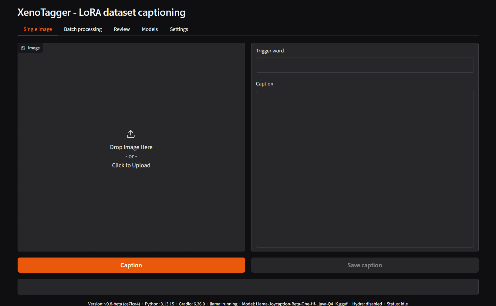
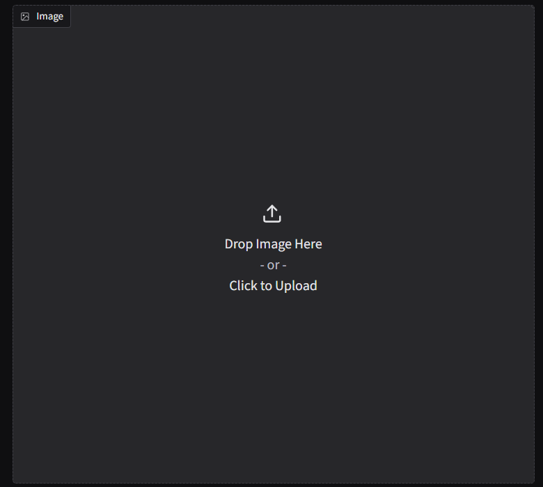
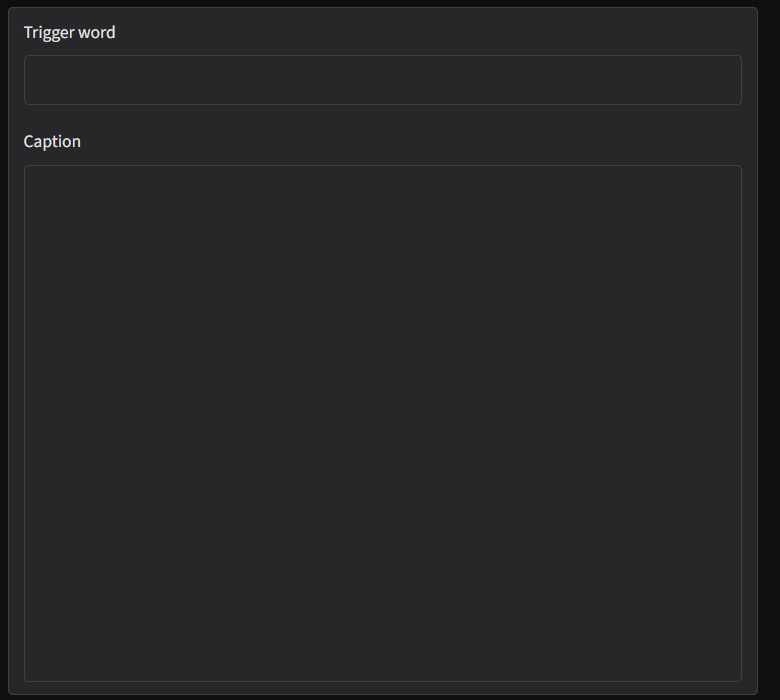

# Single image tab

Captions one image and shows the result before anything is written to
disk. Use this tab to test a model, a prompt template, or a trigger word
before committing to a full batch run.

This tab is disabled until a llama.cpp server is reachable - see
[Settings – Llama](tab-settings-llama.md) and the
[first run walkthrough](firstrun.md).

## Image panel

Drop an image onto the panel, or click it to open a file picker.
Uploading a new image clears any previous caption in this tab.

## Trigger word and Caption fields

- **Trigger word** - prepended to the generated caption. Empty by
  default. Pre-filled from the **Default trigger word** set on
  [Settings – Captioning defaults](tab-settings-captioning-defaults.md),
  but can be overridden per image without changing that default.
- **Caption** - the model's output. Editable directly; changes here are
  only written to disk after clicking **Save caption**.

## Actions

- **Caption** - sends the image to the vision model using the current
  [Llama settings](tab-settings-llama.md) (prompt template, temperature,
  top-p, max tokens, timeout) and, if enabled, the
  [Hydra classifier](tab-settings-hydra.md). While running, this button
  is replaced by **Interrupt**, which cancels the in-flight request.
- **Save caption** - writes the current contents of the Caption field to
  a `.txt` file next to the source image. Disabled until the Caption
  field contains text.

A status line below the buttons reports progress (e.g. `captioning...`,
`tagging (Hydra)...`) while a request is running, then a summary
(elapsed time, token count) once it completes.

## Related

- [Settings – Llama](tab-settings-llama.md) - prompt template and generation parameters used by **Caption**.
- [Settings – Hydra](tab-settings-hydra.md) - enable/disable the tag-appending pass.
- [Settings – Image resizing](tab-settings-image-resizing.md) - how the uploaded image is downscaled before being sent to the model.
- [Settings – Captioning defaults](tab-settings-captioning-defaults.md) - where the default trigger word comes from.

---

[← First run walkthrough](firstrun.md) · [Manual home](README.md) · [Batch processing tab →](tab-batch-processing.md)
